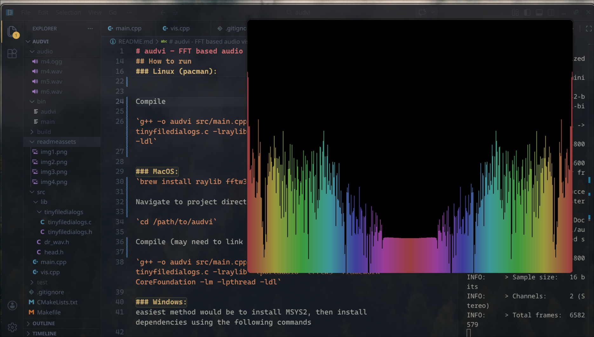
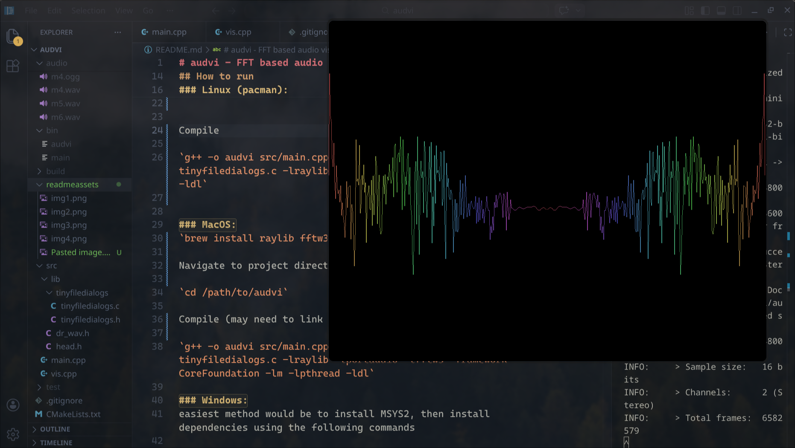

# audvi - FFT based audio visualiser

Audvi is a real-time audio visualizer program that displays the frequency spectrum of sound input. The program supports two input sources: live microphone capture and WAV file playback. Audio is sampled and then processed using Fast Fourier Transform (FFT) algorithm to extract frequency components (bins), which are then displayed as either bars or a line graph. 

## Screenshots  

Demonstration of audvi can be watched [here](https://drive.google.com/file/d/16aNEdb5yDg8xhbE62zNlM9b3lqjbJH6H/view?usp=sharing).





## How to run 

### Linux (pacman):
`sudo pacman -S raylib fftw3 portaudio`  

Navigate to project directory  

`cd /path/to/audvi`  


Compile  

`g++ -o audvi src/main.cpp src/vis.cpp src/lib/tinyfiledialogs/tinyfiledialogs.c -lraylib -lportaudio -lfftw3 -lm -lpthread -ldl`  


### MacOS:
`brew install raylib fftw3 portaudio`  

Navigate to project directory  

`cd /path/to/audvi`

Compile (may need to link CoreFoundation framework)  

`g++ -o audvi src/main.cpp src/vis.cpp src/lib/tinyfiledialogs/tinyfiledialogs.c -lraylib -lportaudio -lfftw3 -framework CoreFoundation -lm -lpthread -ldl`

### Windows:
easiest method would be to install MSYS2, then install dependencies using the following commands

```
pacman -S mingw-w64-x86_64-raylib
pacman -S mingw-w64-x86_64-fftw
pacman -S mingw-w64-x86_64-portaudio
```

then compile with  
 
`g++ -o -std=c++17 -o audvi.exe src/main.cpp src/vis.cpp src/lib/tinyfiledialogs/tinyfiledialogs.c -lraylib -lportaudio -lfftw3 -lwinmm -lws2_32 -lole32 -lcomdlg32 -lm -lpthread`

## Usage

```
./main <flag>
```

only `.wav` playback possible for now.

### Flags

`-m` -> process FFT through microphone input
`-f` -> process from `.wav` file

Press `<SPACE>` while playing to toggle between bar dislpay and graph display.

## Dependencies

1. [raylib](https://www.raylib.com/) used for rendering graphics and audio playback  
2. [fftw](https://www.fftw.org/) used for computing FFTs  
3. [dr_wav](https://github.com/mackron/dr_libs/blob/master/dr_wav.h) used for decoding .wav files (included in the /lib/ directory)
4. [portaudio](https://www.portaudio.com/) used for processing microphone input
5. [tinyfiledialogs](https://sourceforge.net/projects/tinyfiledialogs/) used for processing file input